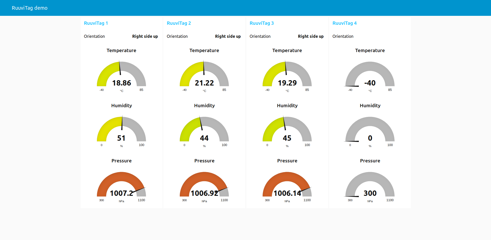
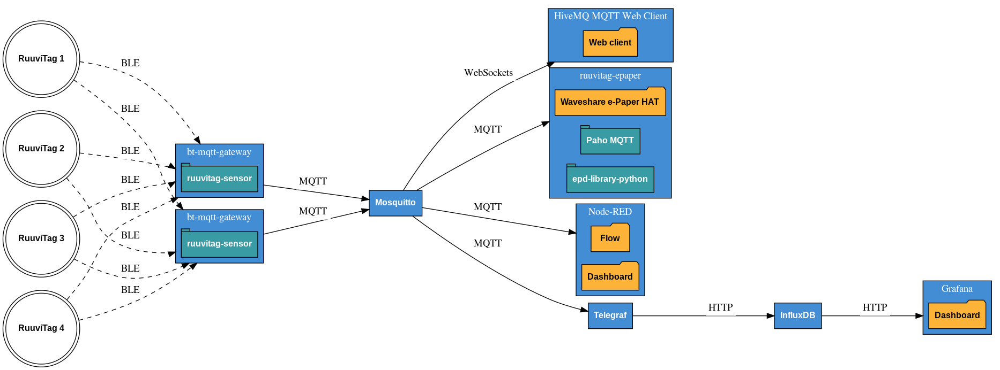

# RuuviTag Demo

This is a demo of reading Bluetooth Low Energy sensor measurements of RuuviTag environmental sensors and feeding them to MQTT, a database and dashboards.

This project is not affiliated to the [Ruuvi](https://ruuvi.com/) company in any way.

## Screenshots

Grafana dashboard:


Node-RED dashboard:



## System requirements
You need a Linux system with Bluetooth Low Energy (BLE) adapter, so at least Bluetooth 4.0.

The demo uses Docker, so it has to be installed.

This demo has been tested on:

  * Raspbian Buster Lite (on a Raspberry Pi 3B)
  * Ubuntu Desktop 19.10

All instructions assume the first configuration. It should run on other Linux systems with minor adjustments, though.

### Checking your Bluetooth adapter
Your system should have a Bluetooth Low Energy adapter, as is available in all recent Raspberry Pi models. You can verify this with:

```shell
hciconfig -a
```

This should show a device **hci0** as **UP RUNNING** and the **LMP Version** should be at least 4.0.

### Installing Docker and Docker Compose
Docker can be installed with:

```shel
curl -sSL https://get.docker.com | sh
```

And give the `pi` user access to Docker by adding it to the `docker` group:

```shell
sudo usermod pi -aG docker
```

Log out and then log in again, so the group permissions are applied to your session.

Then install Python's pip package manager:

```shell
sudo apt install python3-pip
```

And install Docker Compose:

```shell
sudo pip3 install docker-compose
```

## Installation
Clone the repository (you may have to `sudo apt install git` first) and enter the directory:

```shell
git clone https://github.com/koenvervloesem/ruuvitag-demo.git
cd ruuvitag-demo
```

Change the owner of the `grafana` directory:

```shell
sudo chown -R 472:472 grafana
```

## Configuration
Add the MAC addresses of your RuuviTag sensors to the `bt-mqtt-gateway/config.yaml` file. You can find these by scanning for Bluetooth Low Energy devices in your neighborhood:

```shell
sudo hcitool lescan
```

Or you can run the Ruuvi Station app [on Android](https://github.com/ruuvi/com.ruuvi.station) or [on iOS](https://github.com/ruuvi/com.ruuvi.station.ios) and have a look at the MAC address in the tag settings of each RuuviTag.

The Node-RED flow and Grafana dashboard suppose that you have four tags, called `tag1`, `tag2`, `tag3` and `tag4`. So I suggest that initially you leave these names in `bt-mqtt-gateway/config.yaml`. After starting up the demo, you can always change the configuration.

## Starting the demo
Starting the demo is easy, as it's using Docker Compose:

```shell
docker-compose up -d
```

This starts seven Docker containers:

  * [bt-mqtt-gateway](https://github.com/zewelor/bt-mqtt-gateway): Reads RuuviTag sensor measurements using Bluetooth Low Energy and forwards them to a MQTT broker.
  * [Mosquitto](https://mosquitto.org/): Receives the MQTT messages from bt-mqtt-gateway and relays them to anyone who is interested.
  * [HiveMQ MQTT Web Client](https://github.com/hivemq/hivemq-mqtt-web-client): Connects to Mosquitto and shows you the MQTT messages in your web browser using WebSockets.
  * [Node-RED](https://nodered.org/): Subscribes to the MQTT messages from Mosquitto and shows the values in a dashboard.
  * [Telegraf](https://www.influxdata.com/time-series-platform/telegraf/): Collects MQTT messages from Mosquitto and sends the values to InfluxDB.
  * [InfluxDB](https://www.influxdata.com/): Stores all the values of the RuuviTag measurements in a time-series database.
  * [Grafana](https://grafana.com/): Shows the values of the InfluxDB database in a dashboard.

You have access to:

  * The MQTT web client on http://localhost:8080
  * The Node-RED flow on http://localhost:1880
  * The Node-RED dashboard on http://localhost:1880/ui
  * The Grafana dashboard on http://localhost:3000

## Extra demo: e-Paper HAT
If you have a Waveshare 2.7 inch three-colour e-Paper HAT, you can use this demo in combination with the [RuuviTag ePaper](https://github.com/koenvervloesem/ruuvitag-epaper) project on a Raspberry Pi:

  * Build the Docker container of that project.
  * Start this container together with the containers of the RuuviTag Demo: `docker-compose up -f docker-compose-epaper.yml up -d`.

This shows the temperature and humidity measurements of the four configured RuuviTag sensors on the display, as well as the date, time and IP address. The latter is a nice way to know which IP address you have to log into to access the dashboards.

## Security
This is purely a demo of how you can process RuuviTag sensor measurements, so there are no special security measures such as encryption, and minimal authentication and user permissions. Only use this demo for evaluation purposes.

The following default passwords are configured after installation:

  * Node-RED dashboard: username **admin** and password **password**. To change this, run `docker exec -ti node-red /usr/local/bin/node -e "console.log(require('bcryptjs').hashSync(process.argv[1], 8));" your-password-here` with your new password instead of `your-password-here` and paste the output string in the line `password: "$2a$08$zZWtXTja0fB1pzD4sHCMyOCMYz2Z6dNbM6tl8sJogENOMcxWV9DN.",` after the line `username: "admin",` in the file `node-red/settings.js`. After this, restart Node-RED with `docker-compose restart node-red`.
  * Grafana: username **admin** and password **admin**. After the first login, you're asked to choose another password.

If you want to know more about securing Mosquitto and Node-RED, please consult my book [Control Your Home with Raspberry Pi: Secure, Modular, Open-Source and Self-Sufficient](https://koen.vervloesem.eu/books/control-your-home-with-raspberry-pi/) and the accompanying GitHub repository [koenvervloesem/raspberry-pi-home-automation](https://github.com/koenvervloesem/raspberry-pi-home-automation).

## Stopping the demo
If you want to stop the demo, just run:

```shell
docker-compose down
```

If you run the extra demo with the e-Paper HAT, stop the demo like this:

```shell
docker-compose -f docker-compose-epaper.yml down
```

## Architecture

This is the architecture of the demo:



This diagram shows two instances of `bt-mqtt-gateway`. You can use as many as you want, installed on Raspberry Pis or other devices positioned in multiple places for the best Bluetooth coverage of all sensors.

While the demo installs all components on one device, you can distribute them over various devices. For instance, bt-mqtt-gateway on various receiver devices, ruuvitag-epaper on a Raspberry Pi with the Waveshare e-Paper HAT, HiveMQ MQTT Web Client on a developer laptop, and Mosquitto, Node-RED and Telegraf/InfluxDB/Grafana on a Linux server.

## License
This program is provided by [Koen Vervloesem](mailto:koen@vervloesem.eu) as open source software with the MIT license. See the LICENSE file for more information.
